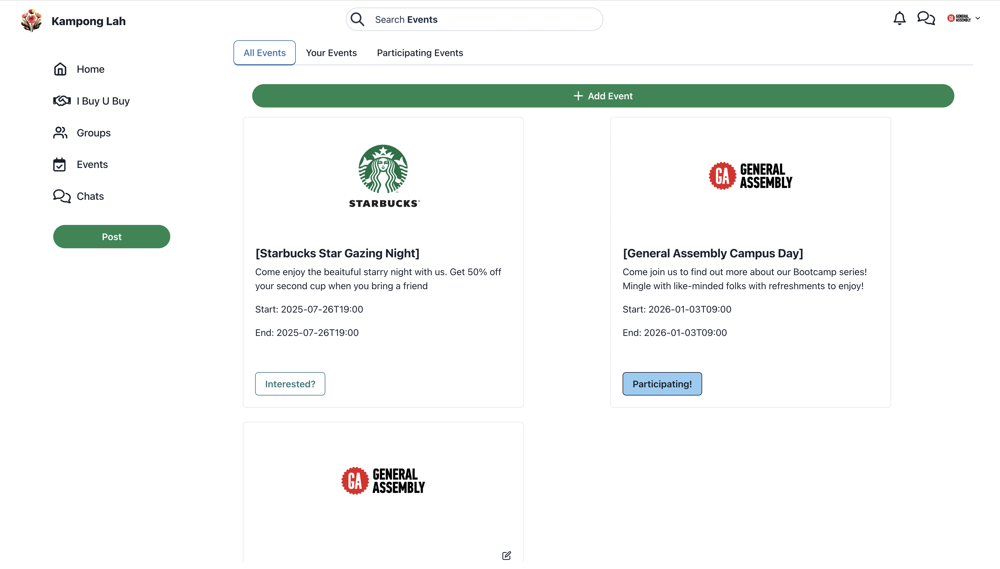

# Kampong Lah (neighbourhood app)
 

 
 

This is a proof-of-concept for a neighbourhood social network in Singapore.

[demo on Vercel](https://sglocals-frontend-c8kb.vercel.app/)

## Tech Stack & Resources

**MERN stack**

**Frontend Libraries:** 
* **Reach JS**
* **Chakra UI**
* **Fuse.js**

**Frontend Libraries:** 
*  **Pusher**
*  **Clerk**
*  **Cloudinary**

**Next Steps**:
  - Search/ Filter/ Sorting Function 
  - Mobile Responsive
  - Improve Security/ Authorizations/ Permissions 
  - Merchant account integration
  - Comments-on-comments
  - Data validation (Zod)
